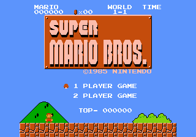
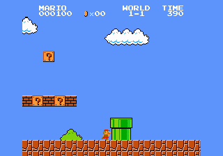
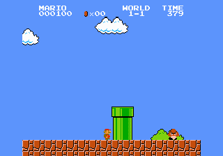

# SMBNeo

**Super Mario Bros. running as a native Neo Geo cartridge.**

SMBNeo is a playable, open-source Neo Geo port built around a pure C game
core. It runs on the MC68000, draws the game with the Neo Geo's tile and
sprite hardware, and plays music and sound through the Z80 and YM2610.

This repository is a Neo Geo-focused fork of
[`nathsou/smb`](https://github.com/nathsou/smb). It is still a work in
progress, but the game is playable from the title screen through the ending.

## Play online

**[Launch SMBNeo in your browser](https://sabino.pro/smbneo/)**

Choose your own supported `.nes` file, ZIP, or locally built
`smbneogeo.zip`. The file stays in your browser and is never uploaded.

Use the arrow keys to move, `A` to jump, `S` to run or throw fireballs, `1`
to start, and `2` to select.

## Screenshots

<p align="center">
  
  
  
</p>

<p align="center"><sub>The title screen and World 1-1 from the current Neo Geo build.</sub></p>

## What works

- The original title screen, menu, stages, enemies, power-ups, and ending.
- Neo Geo joystick and button input.
- Backgrounds, objects, palettes, and the HUD rendered directly with Neo Geo
  graphics hardware.
- Music and sound effects played through the Neo Geo sound hardware.
- Full progression through all 32 stages.
- More on-screen objects without reproducing the original console's small
  sprite-per-scanline limit.

## Controls

| Action | Neo Geo | Default keyboard |
| --- | --- | --- |
| Move | Joystick | Arrow keys |
| Jump / swim | A | `A` |
| Run / fire | B | `S` |
| Start | Start | `1` |
| Select | Select | `2` |

Press Start on the title screen before trying to move Mario.

## Build and play

You will need the
[ngdevkit](https://github.com/dciabrin/ngdevkit) toolchain and a legally
obtained game image. The input may be a raw `.nes` file or a ZIP containing
one `.nes` file.

```bash
git clone https://github.com/sabino/smbneo.git
cd smbneo

make cart SMB_ROM="/path/to/smb.zip"
make run SMB_ROM="/path/to/smb.zip"
```

The supported game revision has SHA-1
`ea343f4e445a9050d4b4fbac2c77d0693b1d0922`.

The build creates the Neo Geo cartridge locally under
`platform/neogeo/build/`. Generated graphics and cartridge files are ignored
by Git and must not be redistributed.

The versions used for the current build are listed in
[Tested toolchain](docs/TESTED_TOOLCHAIN.md).

## How it works

The upstream project translates the original game logic into C. SMBNeo
compiles that code for the Neo Geo's MC68000 and supplies new platform code
for video, sound, controls, timing, and cartridge startup.

Instead of drawing a complete image in work RAM every frame, the renderer
maps the game's background tiles and objects onto Neo Geo sprites and uses
the FIX layer for the status display. This keeps memory use low and lets the
graphics hardware do most of the drawing.

During a local build or browser launch, the graphics needed by the port are
converted from the user-supplied game image. No game ROM, generated graphics,
or packaged cartridge is included in this repository.

## Project status

The complete game is playable in the emulator, including enemy-heavy stages
and the final ending. Performance, sound balance, input, scrolling, title
screen rendering, and crowded scenes have all received target-specific work.

Physical AES/MVS and flash-cartridge testing is still outstanding. Sound is
adapted to the Neo Geo hardware rather than reproduced waveform-for-waveform,
and further performance and fidelity improvements are welcome.

## Development

Run the ROM-free test suite before submitting a change:

```bash
make ci
```

For contribution guidelines and deeper technical information, see:

- [Contributing](CONTRIBUTING.md)
- [Neo Geo port architecture](docs/NEOGEO_PORT.md)
- [Visual fidelity](docs/VISUAL_FIDELITY.md)
- [Changelog](CHANGELOG.md)

## Credits

- [`nathsou/smb`](https://github.com/nathsou/smb), the static-recompilation
  project on which this fork is based.
- [doppelganger's SMBDIS
  disassembly](https://www.romhacking.net/documents/344/), used by the
  upstream translator.
- The ngdevkit contributors and the wider Neo Geo development community.

See [Third-party notices](THIRD_PARTY_NOTICES.md) for full attribution.

SMBNeo is an unofficial fan project and is not affiliated with Nintendo or
SNK. Game names, characters, graphics, audio, and related trademarks belong
to their respective owners. The repository source code is provided under the
[Apache License 2.0](LICENSE); that license does not grant rights to the
underlying game or its assets.
